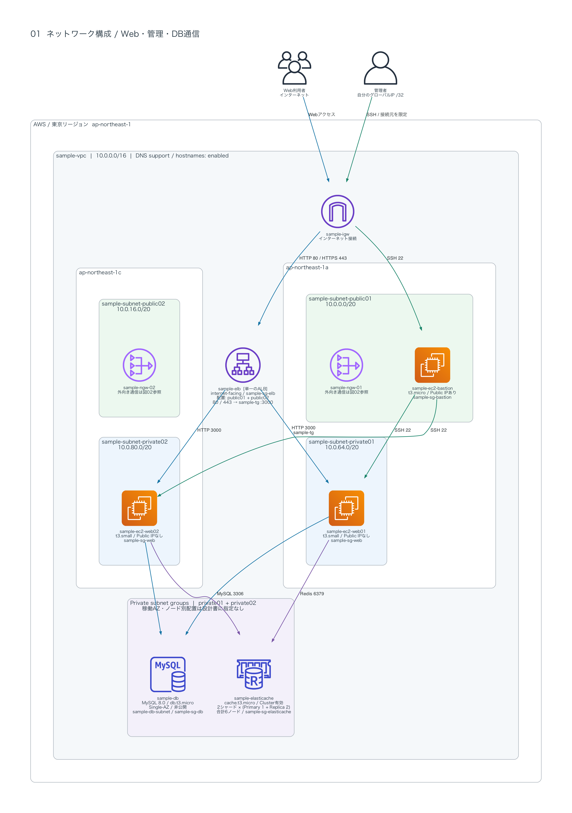
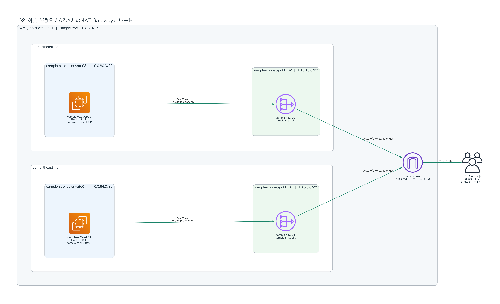
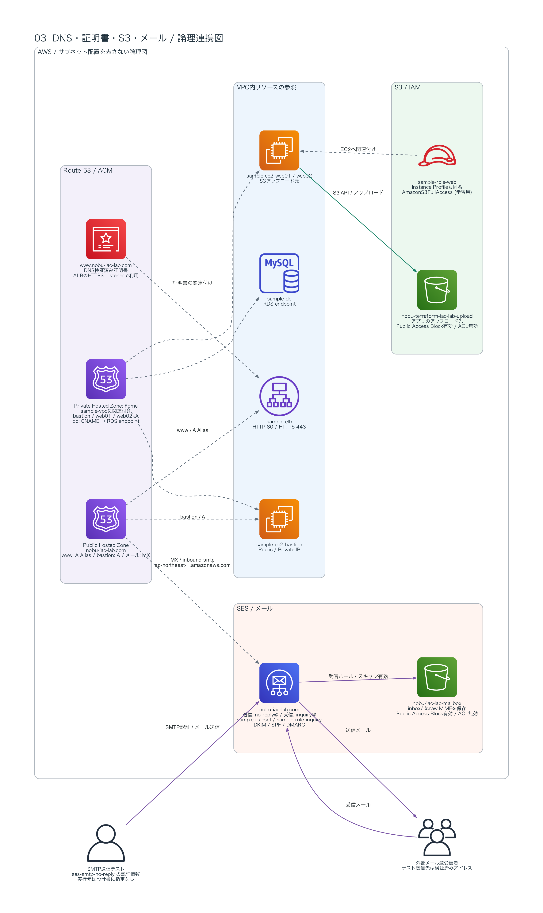

# AWS Webアプリケーション基盤の構成図

提供されたインフラ設計書をPython Diagramsで可視化したもの。AWSの実環境を照会した結果ではない。作図時にAWSリソースの作成・変更・削除は行っていない。

[リポジトリのREADME](../../README.md#network-architecture) / [設計仕様書](../Design_Specification.md)

## 図一覧

- [1. ネットワーク構成](#1-ネットワーク構成)
- [2. 外向き通信とルート](#2-外向き通信とルート)
- [3. DNS・S3・メール連携](#3-dnss3メール連携)
- [読み方と未指定事項](#読み方と未指定事項)
- [再生成](#再生成)

## 1. ネットワーク構成



[拡大用SVG](01-network.svg)

青線はWeb・DB通信、緑線は管理用SSH、紫線はRedis通信を表す。ALBから両AZのWebサーバーへ転送する。矢印は接続開始方向であり、応答通信は省略する。

ALBは単一の論理リソースを図示し、実際の配置先はpublic01とpublic02の両方。配置を一方のAZに固定した図ではない。NAT Gateway 01/02と外向き経路の詳細は図02に分離した。

| 接続先SG | 許可元 | ポート |
| --- | --- | --- |
| sample-sg-bastion | 自分のグローバルIP /32 | TCP 22 |
| sample-sg-elb | 0.0.0.0/0 | TCP 80 / 443 |
| sample-sg-web | sample-sg-bastion | TCP 22 |
| sample-sg-web | sample-sg-elb | TCP 3000 |
| sample-sg-db | sample-sg-web | TCP 3306 |
| sample-sg-elasticache | sample-sg-web | TCP 6379 |

## 2. 外向き通信とルート



[拡大用SVG](02-egress.svg)

Private 01はNAT 01、Private 02はNAT 02を使用する。図は設計書のデフォルトルートを表し、すべての外向き通信がSG等で許可済みであることを示すものではない。VPC内のlocalルートと応答通信は省略する。

## 3. DNS・S3・メール連携



[拡大用SVG](03-services.svg)

実線はデータやメールの流れ、灰色破線はDNS参照・証明書・IAMの関連付けを表す。DNSサーバーをアプリケーション通信が通過するという意味ではない。この図ではサブネット配置とNAT経路を省略する。

## 読み方と未指定事項

- RDSはSingle-AZの1インスタンス。DB Subnet Groupに2つのサブネットが含まれていても、DBが2台存在するわけではない。実際の稼働AZは設計書に指定がないため断定しない。
- Redisは2シャード、各シャードがPrimary 1台とReplica 2台、合計6ノード。各ノードのAZ割り当ては未指定。図の1アイコンはReplication Group全体を表す。
- RDSとRedisを囲む枠は既存のprivate01/private02を使う論理的なグループであり、追加のサブネットではない。
- RDS DB Subnet Groupは`sample-db-subnet`、Redis Cache Subnet Groupは`sample-elasticache-sg`。RedisのSecurity Group `sample-sg-elasticache`とは別リソース。
- HTTP 80は設計書どおりターゲットグループへ転送する。HTTPSへのリダイレクトには変更していない。
- S3 VPC Endpoint、Auto Scaling、CloudWatch等は設計書の現行構成に含まれないため追加していない。
- SES送信テストの実行元やSMTPポートは未指定のため、Webサーバーから送信すると決めつけていない。
- AMI、エンジンバージョン、料金、現行のサービス提供状況はこの作図では検証していない。

## 再生成

[Pythonコード](network_diagrams.py) / [依存パッケージ](requirements.txt)

macOSでGraphvizとPythonが使える環境を前提とする。Diagramsの導入手順は[公式ドキュメント](https://diagrams.mingrammer.com/docs/getting-started/installation)を参照。

このフォルダで次を実行する。

```bash
python3 -m venv .venv
.venv/bin/python -m pip install -r requirements.txt
.venv/bin/python network_diagrams.py
```

PNGとSVGを各3枚生成する。出力先はスクリプトと同じフォルダ。日本語フォントはmacOSの`Hiragino Sans`を使用し、他の環境では`DIAGRAM_FONT`環境変数で変更できる。

SVGにはAWSアイコンを埋め込むため、PNGと同様に単体で共有できる。
